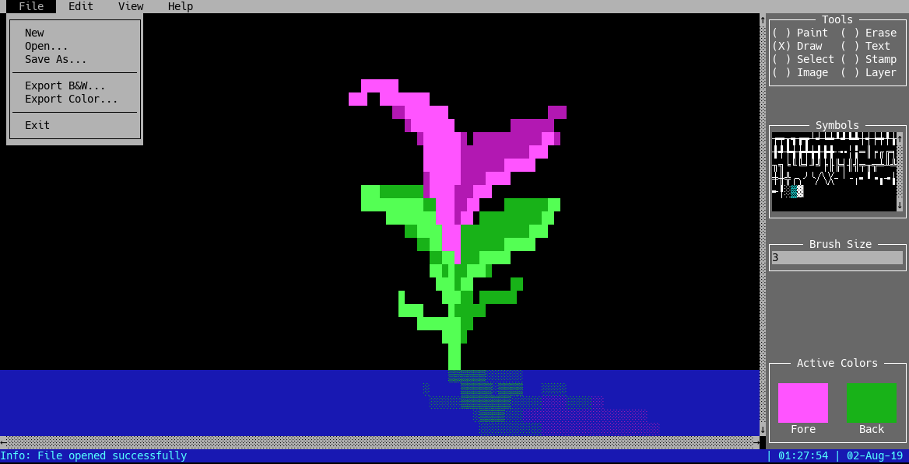

# NetPaint
NetPaint is a 100% text-only drawing program, compatible with any terminal emulator that supports the mouse, such as PuTTY, Konsole, iTerm2, and many others.  It was inspired by creative ASCII art and my many fond memories of dialup BBSes.  NetPaint provides a robust drawing experience completely within the terminal, allowing you to create a wide range of ASCII art, either locally or remotely.  NetPaint also exports to normal text files, allowing you to incorporate your creations into server MOTDs, software manuals, or any other text environment.

Available tools include:
* Paint - Paint using solid rectangle of the foreground color.  The 'Brush Size' option controls the size of the rectangle.
* Erase - Erase using solid rectangle (sets to transparent).  The 'Brush Size' option controls the size of the rectangle.
* Draw - Draw using rectangle of the selected symbol, drawn using foreground and background colors.  The 'Brush Size' option controls the size of the rectangle.
* Text - Begin writing text using foreground and background colors. Press enter to advance to next line, and escape to exit text mode.
* Select - Select a new rectangular region for cut/copy/clear (Edit menu).
* Stamp - Paste the cut/copied region using the original or active colors.
* Image - View/edit image dimensions.  Click apply to update or reset to revert.
* Layer - View/edit layer information.  All tools will update the currently active layer.  All layers except 0 may be set as visible or hidden. Flattening the image will combine all layers into layer 0 (applied in order).

NetPaint is programmed in Python, and makes use of the [Urwid](http://urwid.org/) library for curses functionality.
